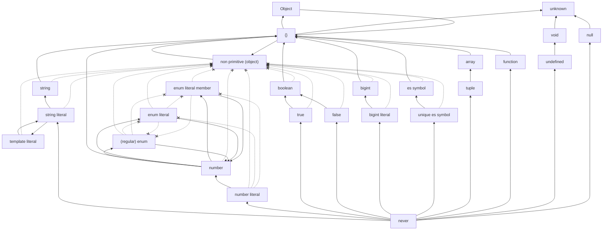

# ts-extends-hierarchy

TS における[代入可能関係](https://www.typescriptlang.org/docs/handbook/type-compatibility.html#subtype-vs-assignment)のグラフを生成します。



それぞれの型は、矢印を推移的にたどって到達可能な型に直接代入可能です。到達不可能なら直接代入も不可能です。

ただし、推移性の一部に例外があり、そのような関係は「バツの矢印」で示されます。これは、矢印の根の型を先（バツが書かれている側）の型に直接代入できないことを表します。

## 実行

以下のコマンドで`graph.md`が生成されます

```sh
npm i
./create_graph.sh
```

## 仕組み

とても変なことをしているのでマネしないでください。

まず、`create_graph.sh`は`checkSubtypeRelation.ts`を型検査します。このファイルは、予め与えられた型同士の代入可能関係を計算し、その結果を以下のようなタプル型として表し、`null`型の変数に代入しようとします。

```typescript
[["unknown", "unknown"], ["{}", "unknown"], ... ]
```

当然、tsc は次のようなエラーを出します

```
src/checkSubtypeRelation.ts:116:7 - error TS2322: Type 'null' is not assignable to type '[["unknown", "unknown"], ["{}", "unknown"], ...
```

`create_graph.sh`は、sed を使って`[["unknown", "unknown"], ...`の部分の文字列を取り出します。

次に、`create_graph.sh`は`createGraph.ts`の先頭に、先程の型を TS の値として追加します。つまり、以下のようなコードを生成します。

```typescript
const relations = [["unknown", "unknown"], ["{}", "unknown"], ... ];
```

そして、`createGraph.ts`を実行すると、グラフの`mermaid`コードが生成され、それが`graph.md`に書き出されます。

したがって、`src`以下の 2 つのファイルで型エラーが起きているのは意図した挙動です。

上記の方法はまったく正攻法ではありません。本当は TS の API などを駆使して実現したかったのですが、それを調べる時間がありませんでした。
