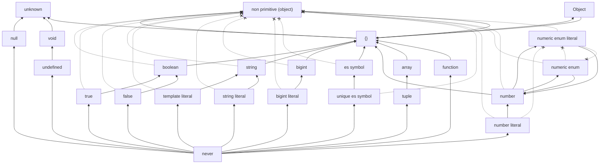

# ts-extends-hierarchy

TS における[代入可能関係](https://www.typescriptlang.org/docs/handbook/type-compatibility.html#subtype-vs-assignment)のグラフを生成します。



それぞれの型は、矢印を推移的にたどって到達可能な型に直接代入可能です。到達不可能なら直接代入も不可能です。

ただし、推移性の一部に例外があり、そのような関係は「バツの矢印」で示されます。これは、矢印の根の型を先（バツが書かれている側）の型に直接代入できないことを表します。

## 実行

以下のコマンドで`graph.md`が生成されます

```sh
npm i
npm start
```
